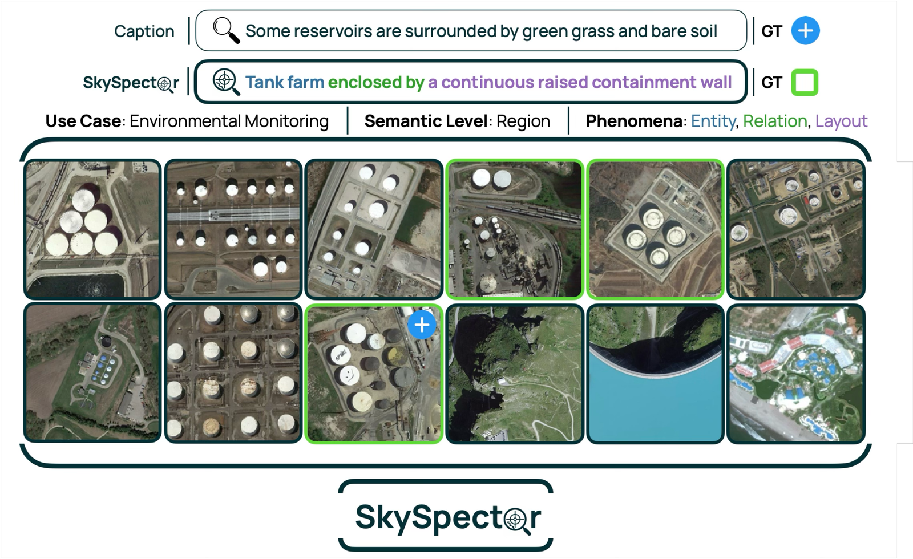

#  SkySpector: Query-Centric Multi-Positive Retrieval for Earth Observation

[](https://terrabytes-workshop.github.io/)


**Naël Ouerghemi**<sup>1</sup> · **Ciprian Tomoiagă**<sup>2</sup> · **Thibault Laugel**<sup>2,3</sup> · **Marcin Detyniecki**<sup>2,3,4</sup>

<sup>1</sup> EPFL · <sup>2</sup> AXA · <sup>3</sup> TRAIL, LIP6, Sorbonne Université · <sup>4</sup> IBS PAN

---

<p align="center">
  
</p>

<p align="center">
  <em>Caption benchmarks reward retrieving the single source image of a sentence, even when
  several related scenes are in the pool. SkySpector instead poses an analyst-style query,
  where every scene satisfying the intent is relevant, making retrieval multi-positive.</em>
</p>

---

## Abstract

Earth Observation (EO) text-image retrieval benchmarks reward a system for ranking the
single image that produced a caption above all others. Analysts, however, issue intent
queries such as *"bridges still passable in the flooded area"*, which may match only a
small region but across many tiles, making retrieval **multi-positive**.

We introduce SkySpector, the first multi-positive, query-centric EO retrieval benchmark:
412 queries authored or validated by EO experts, each paired with a vetted set of relevant
images (avg. 4.6) in a shared pool of 972 images. Unlike a caption-derived corpus, each
text is annotated against the shared pool rather than only against its seed image. Queries
are stratified by semantic level (scene, region, instance) and tagged with six phenomena
(entity, attribute, relation, count, layout, context), so scores can be sliced by
capability. We build SkySpector on established EO datasets, inheriting public,
well-sampled imagery and augmenting it with analyst-grade text and provenance-preserving
relevance labels; every query keeps its source dataset and image identifiers.

Evaluating 16 vision-language models (VLMs) shows that benchmark construction changes
conclusions: model rankings that are stable across three caption benchmarks
(Kendall's τ ≥ 0.72) collapse on SkySpector (τ = 0.13 vs. RSITMD), with the largest drops
on relation, count, and layout queries. We posit that single-vector CLIP-style retrieval
is insufficient for real-world tasks: the best first-stage full-pool score is
38.1 NDCG@10, while a simple multimodal-LLM reranking baseline recovers +13.9 NDCG@10
within the top-50 candidate pool.

---

## Status

The benchmark, evaluation code and leaderboard are being prepared for release.
This repository will host them.

---

## Citation

If you find this work useful, please cite:

```bibtex
@inproceedings{ouerghemi2026skyspector,
  title     = {{SkySpector}: Query-Centric Multi-Positive Retrieval for Earth Observation},
  author    = {Ouerghemi, Na\"el and Tomoiag\u{a}, Ciprian and Laugel, Thibault and Detyniecki, Marcin},
  booktitle = {TerraBytes Workshop at the European Conference on Computer Vision (ECCV)},
  year      = {2026}
}
```

---

## Contact

Ciprian Tomoiagă — ciprian.tomoiaga@gmail.com
